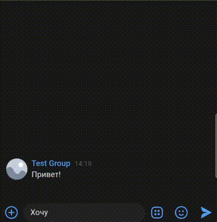

# 🤖 Verbs Play Bot

Бот работает в Telegram и VK, использует DialogFlow для понимания естественного языка и отвечает на вопросы пользователя в дружелюбной форме.

## 📦 Установка

 Установите uv (если еще не установлен)
```bash
curl -LsSf https://astral.sh/uv/install.sh | sh
```

Клонируйте репозиторий
```bash
git clone https://github.com/jendox/dvmn_verbs_play_bot.git
cd dvmn_verbs_play_bot
```

Установите зависимости
```bash
uv sync
```

## ⚙️ Настройка окружения

### Telegram

Напишите в Telegram [@BotFather](https://telegram.me/BotFather).

Создайте нового бота командой /newbot.

Сохраните полученный токен.

Чтобы получить свой chat_id, напишите в Telegram специальному боту: [@userinfobot](https://telegram.me/userinfobot).

### ВКонтакте

Перейдите в создание сообщества ВКонтакте → кнопка «Создать сообщество».

Выберите тип «Публичная страница» или «Группа» — неважно, главное, чтобы можно было включить сообщения.

В настройках группы:

- Открой Сообщения → Включить сообщения сообщества.
- Перейдите в Работа с API → Создать ключ доступа.

Дайте права:

- messages — для работы с сообщениями.
- groups — для получения Long Poll сервера.

Скопируйте ключ доступа (access_token) — он нужен для `.env`.

Получите ID группы: открой страницу сообщества и скопируй число из URL
(например, vk.com/public123456789 → ID = 123456789).

Полная инструкция [здесь](https://dev.vk.com/ru/api/community).

### Настройка Google DialogFlow

Перейдите на [DialogFlow Console](https://dialogflow.cloud.google.com/).

Нажми Create agent и выберите:

- Google Cloud project (или создайте новый)
- Язык: Russian

После создания агента перейди в [Google Cloud Console → Credentials](https://console.cloud.google.com/apis/credentials).

Создайте Service account key:

- Тип: JSON
- Назовите, например, dialogflow-bot

Сохраните скачанный .json — это ваши учётные данные (credentials).

Подробная документация:

[DialogFlow quickstart](https://cloud.google.com/dialogflow/docs/quickstart).

[Создание ключей сервисного аккаунта](https://cloud.google.com/docs/authentication/getting-started).


### Настройте переменные окружения

Создайте файл .env в корне проекта:
```bash
touch .env
```

Добавьте в него переменные:
```env
TELEGRAM_TOKEN=your-telegram-bot-token
TELEGRAM_CHAT_ID=your-telegram-chat-id
VK_TOKEN=your-vk-api-token
DIALOGFLOW_PROJECT_ID=your-project-id
GOOGLE_APPLICATION_CREDENTIALS=path/to/your/credentials.json
```

## 🚀 Управление

### Запуск

Отдельно запустите бота VK и бота Telegram:

```bash
uv run python3 vk_bot.py
uv run python3 tg_bot.py
```

### Остановка

Для корректного завершения работы нажмите `Ctrl+C` в терминале.

## 🧠 Обучение Dialogflow интентами

Файл с обучающими данными — JSON следующего вида:
```json
{
  "Приветствие": {
    "questions": [
      "Привет",
      "Здравствуйте"
    ],
    "answer": "Здравствуйте! Чем могу помочь?"
  },
  "Пока": {
    "questions": [
      "Пока",
      "До встречи"
    ],
    "answer": "До скорого!"
  }
}
```

Загрузка интентов:
```bash
uv run python3 learn_dialogflow.py # по умолчанию читает questions.json
uv run python3 learn_dialogflow.py -f data/qa.json
```

## 📝 Логи в Telegram

Критичные предупреждения и ошибки отправляются в чат TELEGRAM_CHAT_ID.

Формат — HTML; трассировка отправляется моноширинным блоком.

## 📚 Примеры работающих ботов

| Telegram | VK               |
|-----------|------------------|
|  |  |
